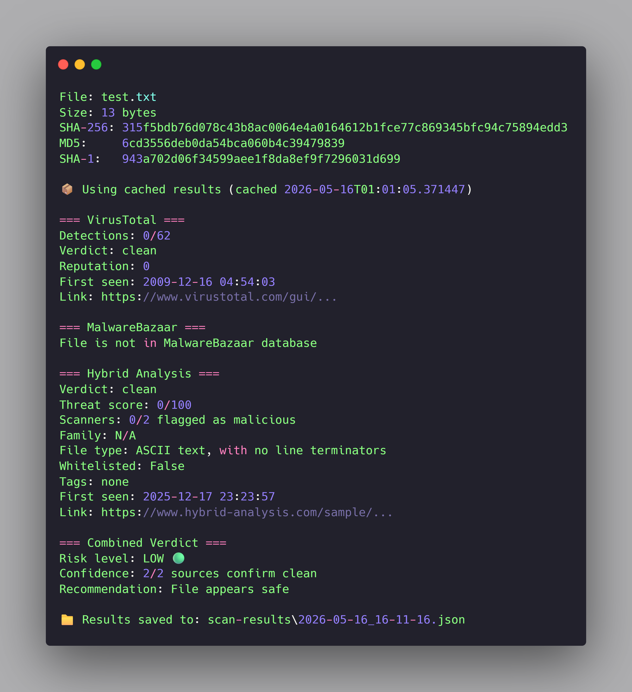
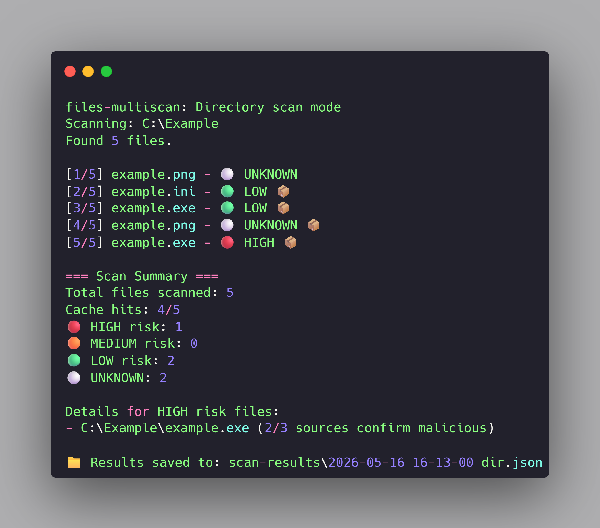

# files-multiscan

A CLI tool that scans files against multiple malware detection services (VirusTotal, MalwareBazaar, Hybrid Analysis) for defensive security analysis.



## About

Most consumer antivirus software comes with significant costs. They consume substantial system resources, run background services you didn't ask for, and uninstalling them often requires jumping through hoops just to remove an application. They feel less like security tools and more like guests who refuse to leave.

I wanted something simpler - a transparent tool that does one job well: tell me whether a file is safe to open. No bundled features, no telemetry, no system overhead. Just a CLI that takes a file path, asks three independent malware detection services about it, and gives me a clear answer.

`files-multiscan` accepts either a single file path or a directory, computes hashes in three formats (SHA-256, MD5, SHA-1) using SHA-256 as the primary identifier, and queries VirusTotal, MalwareBazaar, and Hybrid Analysis in sequence. It returns a structured verdict with direct links to each service's full report, so you can dig deeper if you want to understand exactly what each engine detected.

What makes it useful is what most wallet trackers don't have: **diversification**. If three independent services agree a file is malicious, that's a stronger signal than any single source. The tool aggregates their verdicts into one risk level - HIGH, MEDIUM, LOW, or UNKNOWN - and tells you what to do with the file. You don't have to weigh conflicting opinions yourself.

The second core feature is **local caching**. If you scan a downloaded file once, the result is stored locally. Next time you scan the same file - or a folder containing it - the tool reads from cache instead of making redundant API calls. This means scanning the same Downloads folder five times doesn't burn through your free-tier API quota. The cache expires after 7 days, so detection updates eventually propagate.

The tool is designed for one specific use case: **verifying files before opening them**. If your computer is already infected, this is not the tool you need. But if you're about to open a download from an unfamiliar source, run it through `files-multiscan` first - that's where the value is.

## Features

- **Multi-source verification** - queries VirusTotal, MalwareBazaar, and Hybrid Analysis in sequence, aggregating their verdicts into a single risk level.
- **Single file or directory scan** - point it at one file for a detailed report, or at a folder to recursively scan everything inside.
- **Local hash cache** - results are stored locally for 7 days, so re-scanning the same files is instant and doesn't burn API quota.
- **Rate limiting built-in** - adaptive sleep and retry logic keep you within free-tier API limits (VirusTotal: 4 req/min, Hybrid Analysis: 100 req/min).
- **Aggregated verdict** - combines results from all three sources into HIGH, MEDIUM, LOW, or UNKNOWN risk level with actionable recommendation.
- **JSON scan history** - every scan is saved as a structured JSON file in `scan-results/` for audit, review, or later analysis.
- **Color-coded output** - risk levels are highlighted (red for HIGH, yellow for MEDIUM, green for LOW) so threats are immediately visible.
- **Direct links to full reports** - each scan result includes URLs to VirusTotal, MalwareBazaar, and Hybrid Analysis for deeper investigation.
- **Transparent and lightweight** - pure Python with three dependencies (requests, python-dotenv, colorama). No system services, no telemetry, no installer.

## Installation

### Prerequisites

- Python 3.10 or higher
- API keys from three free services:
  - [VirusTotal](https://www.virustotal.com/) (sign up → profile → API key)
  - [Hybrid Analysis](https://www.hybrid-analysis.com/) (sign up → profile → API keys → Generate)
  - [MalwareBazaar](https://bazaar.abuse.ch/) (sign up → settings → Auth Key)

All three offer generous free tiers, no credit card required.

### Setup

```bash
git clone https://github.com/Frodrinos/files-multiscan.git
cd files-multiscan
python -m venv venv
venv\Scripts\activate     # Windows
source venv/bin/activate  # macOS/Linux
pip install -r requirements.txt
```

### Configuration

Copy the example environment file and add your API keys:

```bash
cp .env.example .env
```

Edit `.env`:

```
VT_API_KEY=your_virustotal_api_key
HA_API_KEY=your_hybrid_analysis_api_key
MB_API_KEY=your_malware_bazaar_api_key
```

You can run the tool without all three keys configured - missing services will simply be skipped during scans.

## Usage

### Scan a single file

```bash
python main.py path/to/suspicious_file.exe
```

This returns the full multi-source report with detection counts, threat scores, malware family classification, and links to each service's full report. Results are cached for 7 days, so repeated scans of the same file are instant.

### Scan an entire directory

```bash
python main.py C:\Users\YourName\Downloads
```

Recursively scans every file in the directory. Output shows each file as a single-line entry with risk level (🔴 HIGH, 🟠 MEDIUM, 🟢 LOW, ⚪ UNKNOWN), and the summary at the end highlights HIGH risk files with details.



### Real-world example: catching a malicious "game crack"

While testing the scanner, I downloaded a file titled `example.exe` from a "free games" website. Running it through the scanner:

```bash
python main.py "example.exe"
```

Result:

- **VirusTotal**: 8/71 engines flagged as malicious
- **Hybrid Analysis**: threat score 76/100, family `Unwanted/Generic`, tagged `evasive`
- **MalwareBazaar**: not in database (typical for fresh PUA samples)
- **Combined Verdict**: 🔴 HIGH - "Do NOT open this file"

This is a typical malware vector - "free crack" downloads from sketchy sites that bundle adware, info-stealers, or backdoors with the requested game files. The scanner caught it before I had a chance to run it.

### Cache management

```bash
python main.py --cache-stats        # show cache size and creation date
python main.py --cleanup-cache      # remove expired entries (older than 7 days)
```

### Scan logs

All scan results are saved as JSON files in `scan-results/`. Each file is named by timestamp and contains the full structured output including all API responses and aggregated verdict - useful for audit, scripting, or later analysis.

## How caching works

The tool maintains a local cache of scan results keyed by SHA-256 hash. The flow is:

1. Before each scan, the tool checks the cache.
2. If the hash is found and not expired (default TTL: 7 days), cached results are returned instantly.
3. If not in cache or expired, the tool queries all configured API sources and stores the result.

This means:

- **First scan** of a file: 3 API calls (one per service).
- **Subsequent scans** of the same file (within 7 days): 0 API calls.
- **Directory rescan**: only new files trigger API calls; everything else is instant.

The cache is stored in `cache/files_cache.json`. You can delete it anytime to start fresh, or use `--cleanup-cache` to remove just the expired entries.

## Project structure

```
files-multiscan/
├── .github/
│   └── images/                  # Documentation screenshots
├── src/
│   ├── aggregator.py            # Combines results into final verdict
│   ├── cache.py                 # Local hash-based result cache
│   ├── colors.py                # Terminal color utilities
│   ├── hybrid_analysis.py       # Hybrid Analysis API client
│   ├── logger.py                # JSON scan result logging
│   ├── malware_bazaar.py        # MalwareBazaar API client
│   ├── rate_limiter.py          # Sliding-window rate limiter
│   └── virustotal.py            # VirusTotal API client
├── .env.example                 # Template for API keys
├── LICENSE                      # MIT License
├── main.py                      # CLI entry point
├── README.md                    # This file
└── requirements.txt             # Python dependencies
```

The architecture is intentionally modular. Each API source has its own client module with a consistent return interface (`status`, `verdict`, `error` fields). The aggregator consumes these unified results regardless of source. Adding a fourth scanning service would require only writing a new client module that matches the same interface - no changes to existing code.

## Disclaimer

This tool is intended for **defensive security purposes only**:

- Verifying downloaded files before opening them
- Auditing your Downloads folder for malware that slipped through
- Malware research and security education
- Building familiarity with multi-source threat intelligence

The tool relies on third-party services (VirusTotal, MalwareBazaar, Hybrid Analysis). No scanner is 100% accurate - use this as one signal among many. A `LOW` or `UNKNOWN` verdict does not guarantee a file is safe, and a `HIGH` verdict could occasionally be a false positive. Always exercise judgment, especially for files from unknown sources.

This tool does not protect against already-installed malware. It only helps prevent infection by warning about files **before** you open them. If you suspect your system is already compromised, run a full antivirus scan and consider professional consultation.

## Roadmap

The current version is a working beta. Planned improvements:

- **Optional opt-in community submissions** - anonymous SHA-256 hashes of HIGH-risk files could be submitted to a public database for malware research. This would be strictly opt-in with full transparency.
- **Integration with public threat feeds** - MalwareBazaar daily exports for offline checking without API calls.
- **Static file analysis** - magic bytes verification, PE header parsing, suspicious filename patterns.
- **Sandbox upload** - for UNKNOWN files, submit to Hybrid Analysis sandbox for behavioral analysis.
- **Multi-format export** - CSV/HTML reports in addition to JSON.
- **GUI version** - desktop application built on top of the CLI core, for users who prefer a visual interface.

If you have ideas or find bugs during testing, open an issue or PR.

## Tech stack

- **Python 3.10+** - primary language
- [**requests**](https://requests.readthedocs.io/) - HTTP client for API calls
- [**python-dotenv**](https://pypi.org/project/python-dotenv/) - environment variable management
- [**colorama**](https://pypi.org/project/colorama/) - cross-platform terminal colors

## License

MIT - see [LICENSE](./LICENSE) for details.
